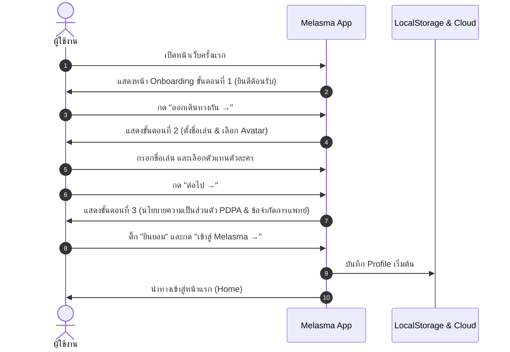
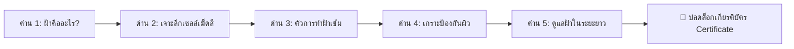
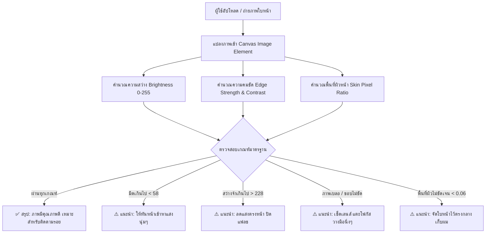

# 📘 คู่มือระบบและเอกสารการใช้งานฉบับสมบูรณ์
## โครงการ Melasma — เรียนรู้ฝ้าอย่างเข้าใจ

---

## 📑 สารบัญ (Table of Contents)
1. [ภาพรวมของโครงการและข้อกำหนดทางการแพทย์ (Overview & Medical Disclaimer)](#1-ภาพรวมของโครงการและข้อกำหนดทางการแพทย์)
2. [สถาปัตยกรรมและเทคโนโลยีที่ใช้ (Architecture & Technology Stack)](#2-สถาปัตยกรรมและเทคโนโลยีที่ใช้)
3. [ขั้นตอนการเริ่มต้นใช้งานครั้งแรก (Onboarding & PDPA Consent)](#3-ขั้นตอนการเริ่มต้นใช้งานครั้งแรก)
4. [โครงสร้างการนำทางและหน้าหลัก (Navigation & Home Dashboard)](#4-โครงสร้างการนำทางและหน้าหลัก)
5. [ระบบภารกิจการเรียนรู้ 5 ด่านและมินิเกม (Mission Map & 5 Scenarios)](#5-ระบบภารกิจการเรียนรู้-5-ด่านและมินิเกม)
6. [คลังความรู้ทางการแพทย์และวิดีโอ (Knowledge Base & Clinical Evidence)](#6-คลังความรู้ทางการแพทย์และวิดีโอ)
7. [ผู้ช่วยอัจฉริยะและระบบตรวจคุณภาพภาพถ่าย (Chatbot, AI & Photo Quality Assessment)](#7-ผู้ช่วยอัจฉริยะและระบบตรวจคุณภาพภาพถ่าย)
8. [ระบบเกียรติบัตรและการตรวจสอบความถูกต้อง (Certificate & Verification System)](#8-ระบบเกียรติบัตรและการตรวจสอบความถูกต้อง)
9. [โปรไฟล์ผู้เล่นและระบบรางวัล (Profile, Badges & Customization)](#9-โปรไฟล์ผู้เล่นและระบบรางวัล)
10. [การตั้งค่าระบบและการเข้าถึง (Settings & Accessibility)](#10-การตั้งค่าระบบและการเข้าถึง)
11. [ระบบหลังบ้านและการจัดเก็บข้อมูล (Backend Google Apps Script & Data Schema)](#11-ระบบหลังบ้านและการจัดเก็บข้อมูล)

---

## 1. ภาพรวมของโครงการและข้อกำหนดทางการแพทย์

เว็บแอป **Melasma (เรียนรู้ฝ้าอย่างเข้าใจ)** ถูกพัฒนาขึ้นเพื่อเป็นเครื่องมือสื่อการสอนและสร้างความตระหนักรู้ด้านสุขภาพผิวหนัง (Health Literacy) โดยเน้นเรื่อง **"ฝ้า (Melasma)"** ผ่านกระบวนการเรียนรู้แบบมีปฏิสัมพันธ์ (Interactive Gamification), เรื่องราวจำลอง (Scenarios), เกมฝึกคิด (Minigames), แชทบอทตอบคำถาม และการประเมินภาพถ่ายเบื้องต้น

### ⚠️ ข้อควรระวังและข้อจำกัดความรับผิดชอบทางการแพทย์ (Medical Disclaimer)
* **เพื่อการเรียนรู้เท่านั้น:** ข้อมูลทั้งหมดในระบบจัดทำขึ้นเพื่อการศึกษาและการดูแลสุขภาพเบื้องต้น ไม่สามารถใช้ทดแทนการตรวจ วินิจฉัย หรือการรักษาโดยแพทย์ผิวหนังผู้เชี่ยวชาญได้
* **ไม่มีการวินิจฉัยโรคจากรูปภาพ:** ระบบตรวจภาพถ่ายทำหน้าที่เพียง *ตรวจคุณภาพแสง ความคมชัด และแนะนำมุมมองในการถ่ายภาพ* เพื่อให้ผู้ใช้สามารถนำภาพที่มีคุณภาพดีไปปรึกษาแพทย์เท่านั้น โดยระบบจะไม่ฟันธงว่าเป็นโรคใดหรือระดับความรุนแรงเท่าใด
* **สัญญาณอันตราย:** หากพบรอยดำที่มีขนาดโตเร็วผิดปกติ ขอบไม่เรียบ สีไม่สม่ำเสมอ คัน เจ็บ มีเลือดออก หรือแผลเรื้อรัง ผู้ใช้ควรพบแพทย์ทันที

---

## 2. สถาปัตยกรรมและเทคโนโลยีที่ใช้

```
┌──────────────────────────────────────────────────────────┐
│                   FRONTEND (React + Vite)                │
│  - React 18 / TypeScript / Tailwind CSS / Framer Motion  │
│  - Zustand State Management (Player, Settings, CertName) │
│  - html-to-image & qrcode (Certificate Generation)       │
│  - Web Audio API & Sound Manager (SFX / BGM)             │
└────────────┬─────────────────────────────┬───────────────┘
             │                             │
             ▼                             ▼
┌───────────────────────────┐ ┌────────────────────────────┐
│   LINE LIFF Integration   │ │  Google Apps Script (GAS)  │
│  - Mock Mode (Dev/Web)    │ │  - Spreadsheet DB (38 cols)│
│  - User ID Hash (Privacy) │ │  - Certificate Generator   │
│  - Share Challenge API    │ │  - Gemini AI Integration   │
└───────────────────────────┘ └────────────────────────────┘
```

* **Frontend:** React 18, TypeScript, Tailwind CSS, Framer Motion, React Router v6
* **State Management:** Zustand (พร้อมระบบ LocalStorage Caching อัตโนมัติ)
* **Backend:** Google Apps Script (Web App Endpoint) เชื่อมต่อ Google Sheets
* **AI Model:** Google Gemini API (ผ่าน Backend Script Properties)
* **ความปลอดภัย:** ส่งเฉพาะ Pseudonymous User ID Hash ไม่เก็บข้อมูลส่วนตัวที่ระบุตัวตนจริง

---

## 3. ขั้นตอนการเริ่มต้นใช้งานครั้งแรก

เมื่อผู้ใช้เข้าเว็บแอปครั้งแรก ระบบจะตรวจพบว่ายังไม่มีโปรไฟล์ และจะนำเข้าสู่หน้า Onboarding อัตโนมัติ (3 ขั้นตอน):



### รายละเอียดในแต่ละขั้นตอนของ Onboarding:
1. **ขั้นตอนที่ 1 — ทำความรู้จัก Skin Lab:** แนะนำตัวละครคุณหมอ 3D และวัตถุประสงค์ในการเรียนรู้ 3 ประการ: *สังเกต* (เข้าใจลักษณะ), *ป้องกัน* (รู้ทันตัวกระตุ้น), และ *ดูแล* (เลือกวิธีที่เหมาะ)
2. **ขั้นตอนที่ 2 — ตั้งค่าโปรไฟล์:**
   - **ชื่อเล่น (Nickname):** ความยาวไม่เกิน 20 ตัวอักษร สำหรับใช้แสดงผลในบทสนทนาและเกียรติบัตร
   - **ตัวแทนของคุณ (Avatar Folder):** เลือกรูปอวตารตัวละคร (สามารถเปลี่ยนได้ภายหลังในหน้าโปรไฟล์)
3. **ขั้นตอนที่ 3 — ความเป็นส่วนตัวและข้อตกลง (PDPA & Disclaimer):**
   - ชี้แจงแบบ Accordion: *ไม่เก็บข้อมูลระบุตัวตนจริง*, *ข้อมูลที่จัดเก็บ (ชื่อเล่น, ความคืบหน้า, วันที่)*, *ข้อควรระวังทางการแพทย์*, และ *สิทธิในการลบข้อมูล*
   - ติ๊กกล่องยืนยันการยินยอมก่อนเข้าสู่ระบบ

---

## 4. โครงสร้างการนำทางและหน้าหลัก

### 🧭 แถบนำทางด้านบน (Top Navigation Bar)
แถบเมนูด้านบนจะแสดงผลตลอดเวลาหลัง Onboarding ประกอบด้วย:
* **โลโก้แบรนด์ Melasma** (คลิกเพื่อกลับหน้าแรก)
* **⌂ หน้าแรก (`/`):** สรุปสถานะและเมนูด่วน
* **▤ คลังความรู้ (`/knowledge`):** บทความเชิงลึกและวิดีโอ
* **▶ เล่นเกม (`/map`):** แผนที่ภารกิจ 5 ด่าน
* **✦ ถามเรื่องฝ้า (`/chatbot`):** ผู้ช่วย AI และการตรวจคุณภาพรูปภาพ
* **⚙ ตั้งค่า (`/settings`):** การแสดงผล เสียง และข้อมูล

---

### 🏠 หน้าแรก (Home Dashboard: `/`)

1. **Hero Section คุณหมอ 3D:**
   - ภาพคุณหมอพร้อมข้อความต้อนรับ
   - **ปุ่ม "เริ่มภารกิจ →":** ทางลัดเข้าสู่หน้าแผนที่ด่าน
2. **แถบความคืบหน้ารวม (Overall Progress Bar):**
   - แสดงตัวเลขด่านที่ผ่าน เช่น `3/5`
   - แถบความยาวเปอร์เซ็นต์แบบแอนิเมชัน
   - **ปุ่ม "🏆 ดูเกียรติบัตร":** จะถูกปิดไว้ (Disabled) จนกว่าผู้เล่นจะผ่านครบทั้ง 5 ด่าน เมื่อครบแล้วจะสามารถกดเข้าไปดูใบประกาศได้ทันที
3. **การ์ดทางลัด 4 หมวดความรู้หลัก:**
   - 🔎 **ความหมาย:** ฝ้าคืออะไร พบบ่อยตรงไหน (ลิงก์ไปยัง `#what-is-melasma`)
   - ☀️ **ตัวกระตุ้น:** แดด ความร้อน ฮอร์โมน (ลิงก์ไปยัง `#melasma-triggers`)
   - 🛡️ **การป้องกัน:** กันแดดและอุปกรณ์บังแดด (ลิงก์ไปยัง `#melasma-protection`)
   - 🩺 **การรักษา:** แนวทางที่ถูกต้องร่วมกับแพทย์ (ลิงก์ไปยัง `#melasma-treatment`)

---

## 5. ระบบภารกิจการเรียนรู้ 5 ด่านและมินิเกม

ระบบการเรียนรู้ถูกออกแบบเป็น 5 ภารกิจ (Scenarios) มีระบบปลดล็อกตามลำดับ (Sequential Unlocking):



### 📋 รายละเอียดเนื้อหาและกลไกในแต่ละด่าน

#### 🟢 ด่าน 1: ฝ้าคืออะไร? (`/scenario/1`)
* **ระดับความยาก:** ง่าย (Easy) | **เวลาโดยประมาณ:** 5 นาที
* **เนื้อหาการเรียนรู้:** นิยามของฝ้า (Melasma), ลักษณะปื้นสีน้ำตาล/เทาที่มักเกิดสมมาตรสองข้าง, ตำแหน่งที่พบบ่อย (โหนกแก้ม หน้าผาก เหนือริมฝีปาก คาง), ความแตกต่างจากโรคติดต่อและมะเร็งผิวหนัง, ผู้ชายก็สามารถเป็นฝ้าได้
* **มินิเกมในด่าน:**
  - `Swipe-Decide` (ปัดจริง–เท็จ): ตัดสินข้อความ 4 ประเด็น เช่น "ฝ้าเป็นโรคติดต่อหรือไม่", "ผู้ชายเป็นฝ้าได้หรือไม่"
  - `Choice Evaluation`: เลือกคำอธิบายลักษณะของฝ้าที่ถูกต้องที่สุด

#### 🟢 ด่าน 2: เซลล์เม็ดสีทำงานอย่างไร? (`/scenario/2`)
* **ระดับความยาก:** ง่าย (Easy) | **เวลาโดยประมาณ:** 5 นาที
* **เนื้อหาการเรียนรู้:** บทบาทของเซลล์สร้างเม็ดสี **Melanocyte**, กระบวนการสร้างและส่งต่อ **Melanin** ไปยังเซลล์ผิวหนังชั้นบน (Keratinocyte), สาเหตุที่ทำให้เกิดปื้นสีเข้มเฉพาะจุด
* **มินิเกมในด่าน:**
  - `Choice Question`: ระบุเซลล์ที่เกี่ยวข้องกับการเกิดฝ้ามากที่สุด (Melanocyte)
  - `Swipe-Decide`: ทำความเข้าใจความเชื่อเรื่องการผลัดเซลล์ผิวและการทำงานของเม็ดสี

#### 🟡 ด่าน 3: ตัวการทำฝ้าเข้ม (`/scenario/3`)
* **ระดับความยาก:** ปานกลาง (Medium) | **เวลาโดยประมาณ:** 6 นาที
* **เนื้อหาการเรียนรู้:** ตัวกระตุ้นหลักและปัจจัยแฝง ได้แก่ รังสี UV (UVA/UVB), แสงที่มองเห็นได้ (Visible Light / HEV Blue Light), ความร้อนจากเตา/ซาวน่า, การเปลี่ยนแปลงของฮอร์โมน (การตั้งครรภ์/ยาคุม), และการระคายเคืองจากการขัดถูหน้าแรงๆ
* **มินิเกมในด่าน:**
  - `Dialogue Investigation`: ให้คำแนะนำเพื่อนที่ฝ้าเข้มขึ้นทั้งที่ไม่ได้ตากแดดจัด
  - `Spot the Lie / Minigame`: ค้นหาข้อความที่เป็นความเชื่อผิดๆ เกี่ยวกับการขัดหน้าและการดูแลผิว

#### 🟠 ด่าน 4: เกราะป้องกันผิว (`/scenario/4`)
* **ระดับความยาก:** ท้าทาย (Hard) | **เวลาโดยประมาณ:** 6 นาที
* **เนื้อหาการเรียนรู้:** การเลือกครีมกันแดด **Broad-Spectrum (UVA/UVB)**, ค่า **SPF 30-50+**, ค่า **PA++++**, ประโยชน์ของกันแดดแบบมีสีที่มี **Iron Oxides** ในการกันแสงสีฟ้า, ปริมาณการทาที่ถูกต้อง (กฎ 2 ข้อมือ / 1/4 ช้อนชา), การทาซ้ำทุก 2 ชั่วโมงเมื่ออยู่กลางแจ้ง และการใช้อุปกรณ์เสริม (หมวกปีกกว้าง ร่ม)
* **มินิเกมในด่าน:**
  - `Order Cards / Step Sequencing`: เรียงลำดับขั้นตอนและปริมาณการทาครีมกันแดด
  - `Arcade Runner / Reaction`: มินิเกมหลบหลีกรังสี UV และเลือกเก็บเกราะป้องกัน

#### 🔴 ด่าน 5: ดูแลฝ้าในระยะยาว (`/scenario/5`)
* **ระดับความยาก:** ด่านสรุปขั้นกว่า (Advance) | **เวลาโดยประมาณ:** 7 นาที
* **เนื้อหาการเรียนรู้:** ตั้งเป้าหมายการรักษาที่ถูกต้อง (การควบคุมให้จางลงและไม่กลับมาเข้ม ไม่ใช่การหายขาดถาวรในคืนเดียว), อันตรายของครีมหน้าขาวที่ผสมสารปรอท/สเตียรอยด์/ไฮโดรควิโนนเข้มข้น, การใช้สกินแคร์ที่ปลอดภัย (Niacinamide, Vitamin C, Azelaic Acid, Tranexamic Acid ชนิดทา), และสัญญาณเตือนที่ต้องพบแพทย์ทันที
* **มินิเกมในด่าน:**
  - `Comprehensive Quiz Evaluation`: ประเมินความเข้าใจรวบยอดทั้งหมด 5 ด้าน
  - เมื่อผ่านด่านนี้ ระบบจะส่งข้อมูลไปบันทึกบน Cloud และปลดล็อกเกียรติบัตรทันที 🎉

---

### 📖 สมุดบทเรียนและสรุปย้อนหลัง (Review System)

1. **สมุดคดีรายด่าน (Stage Review: `/scenario/:id/review`):**
   - เปิดได้เฉพาะด่านที่เล่นจบแล้ว
   - แสดงสรุปใจความสำคัญของด่าน
   - รวมข้อคำถาม ตัวเลือกที่ถูก คำอธิบายทางการแพทย์ และแหล่งอ้างอิง
2. **สรุปบทเรียนรวมทั้งหมด (All Stages Review: `/map/summary`):**
   - รวมรวบประเด็นสำคัญและเฉลยจากทั้ง 5 ด่านไว้ในหน้าเดียวอย่างเป็นหมวดหมู่ เหมาะสำหรับการอ่านทบทวนความรู้ได้อย่างรวดเร็ว

---

## 6. คลังความรู้ทางการแพทย์และวิดีโอ

หน้าคลังความรู้ (`/knowledge`) ได้รับการออกแบบตามมาตรฐาน **Evidence-Based Medical Information** พร้อมระบบอ้างอิงแบบ APA Format:

### 📚 5 หัวข้อความรู้เชิงลึก:
1. **ฝ้าคืออะไร? (`#what-is-melasma`):**
   - กลไกการเพิ่มจำนวนและการทำงานของเม็ดสีเมลานิน
   - กราฟิกแสดง 3 รูปแบบการกระจายตัวบนใบหน้า:
     - **Centrofacial:** กึ่งกลางใบหน้า (หน้าผาก แก้ม จมูก เหนือปาก คาง) — พบบ่อยที่สุด
     - **Malar:** บริเวณโหนกแก้มและสันจมูก
     - **Mandibular:** แนวกรามและคาง
2. **ประเภทของฝ้า (`#melasma-types`):**
   - ตารางเปรียบเทียบ 3 ประเภท พร้อมการตอบสนองต่อการรักษา:
     - **ฝ้าตื้น (Epidermal):** เม็ดสีในชั้นหนังกำพร้า สีน้ำตาลเข้ม ขอบชัด ส่อง Wood's lamp แล้วเข้มชัด ตอบสนองต่อการรักษาได้ดีกว่า
     - **ฝ้าลึก (Dermal):** เม็ดสีในชั้นหนังแท้ สีน้ำตาลเทา/ฟ้า ขอบฟุ้ง ส่อง Wood's lamp แล้วไม่เด่นขึ้น ใช้เวลารักษานาน
     - **ฝ้าผสม (Mixed):** พบบ่อยที่สุด มีทั้งชั้นตื้นและลึก สีหลายเฉด
3. **ตัวกระตุ้นฝ้า (`#melasma-triggers`):**
   - รังสี UV (UVA ก่อเม็ดสีลึก, UVB ก่อผิวไหม้และกระตุ้นเม็ดสี)
   - แสงสีฟ้า (Visible Light จากดวงอาทิตย์)
   - ปัจจัยฮอร์โมน (ฮอร์โมนเอสโตรเจน/โปรเจสเตอโรน)
   - ความร้อนสูงสะสม และการอักเสบระคายเคือง
4. **การป้องกันฝ้า (`#melasma-protection`):**
   - การเลือกกันแดด Broad-Spectrum SPF 50+ PA++++
   - คุณสมบัติของ Iron Oxides
   - ปริมาณ 2 ข้อนิ้วมือ และการทาซ้ำอย่างถูกวิธี
5. **การรักษาและสัญญาณเตือน (`#melasma-treatment`):**
   - แนวทางการใช้ยาทาและการดูแลผิวร่วมกับแพทย์
   - การหลีกเลี่ยงครีมเถื่อน/สารอันตราย 3 ชนิด (สเตียรอยด์, ปรอท, ไฮโดรควิโนนผิดวิธี)
   - **สัญญาณอันตราย:** รอยเปลี่ยนขนาด/รูปทรง/สี, ขอบหยักไม่เรียบ, คัน เจ็บ แตกเป็นแผล มีเลือดออก

### 🎥 วิดีโอแนะนำจากสถาบันการแพทย์:
* *American Academy of Dermatology (AAD):* ดูแลฝ้าในชีวิตประจำวัน & Melasma Do's and Don'ts
* *พบหมอมหิดล:* รู้ทันฝ้า ป้องกันก่อนสายเกินแก้
* *Suandok Channel (รพ.มหาราชนครเชียงใหม่):* ฝ้า กระ รักษาอย่างไรให้หาย
* *โรงพยาบาลรามคำแหง:* การปกป้องผิวจากแสงแดด & ปัญหาเม็ดสีผิวผิดปกติ

---

## 7. ผู้ช่วยอัจฉริยะและระบบตรวจคุณภาพภาพถ่าย

หน้า **ถามเรื่องฝ้า (`/chatbot`)** รวม 3 เครื่องมือสำคัญ:

### 1) หมวดคำถามพบบ่อย (Medical FAQ System)
คลังคำถาม-คำตอบทางการแพทย์ที่จัดกลุ่มไว้ล่วงหน้า พร้อมคำอธิบายและแหล่งอ้างอิง:
* 🔎 **รอยนี้อาจเป็นอะไร?** (แยกฝ้า กระ จุดด่างดำ รอยดำจากสิว)
* ☀️ **ทำไมฝ้าถึงเข้มขึ้น?** (แสงแดด แสงหน้าจอ ฮอร์โมน ความร้อน)
* 🛡️ **ป้องกันอย่างไร?** (เลือกกันแดด การทาทับเมคอัพ กันแดดแบบมีสี)
* 🧴 **รักษาและดูแลอย่างไร?** (สกินแคร์ ยาทา เลเซอร์ การกลับมาเป็นซ้ำ)

### 2) ถามคุณหมอ AI (Gemini AI Integration)
* ผู้ใช้สามารถพิมพ์คำถามอิสระในกล่องข้อความ
* ระบบจะส่งข้อความไปยัง Backend (Google Apps Script) ที่ผสานรวมกับ Google Gemini API
* มี System Prompt กำกับอย่างรัดกุม เพื่อให้ตอบเฉพาะข้อมูลเชิงวิชาการด้านสุขภาพผิวอย่างสุภาพ และย้ำเตือนเรื่องการพบแพทย์เสมอ
* มีระบบ Fallback กรณีออฟไลน์หรือไม่สามารถติดต่อ AI ได้ ระบบจะค้นหาคำตอบที่เกี่ยวข้องจากฐานข้อมูล FAQ ภายในเครื่องให้แทนโดยอัตโนมัติ

### 3) ระบบตรวจคุณภาพภาพถ่าย (Client-Side Photo Quality Assessment)
ออกแบบมาเพื่อช่วยให้ผู้ใช้เตรียมภาพถ่ายสำหรับติดตามรอยผิวหนัง (Skin Tracking) ก่อนนำไปปรึกษาแพทย์ โดยทำงานประมวลผลบนเบราว์เซอร์ของผู้ใช้ (Client-Side HTML5 Canvas) 100% จึงไม่มีการอัปโหลดภาพใบหน้าขึ้นเซิร์ฟเวอร์ รักษาความเป็นส่วนตัวสูงสุด:



---

## 8. ระบบเกียรติบัตรและการตรวจสอบความถูกต้อง

```
┌──────────────────────────────────────────────────────────┐
│                   เกียรติบัตรการเรียนรู้                     │
│                MELASMA LEARNING CERTIFICATE              │
│                                                          │
│     ขอมอบเกียรติบัตรฉบับนี้เพื่อแสดงว่า                         │
│                  [ นายสมชาย รักผิว ]                     │
│                                                          │
│  ได้สำเร็จหลักสูตรการเรียนรู้เรื่องฝ้า (Melasma) ครบ 5 ภารกิจ   │
│                                                          │
│  เลขที่: MEL-2026-00124            วันที่ออก: 25 สิงหาคม 2026 │
│  [ QR Code ตรวจสอบ ]               [ ตราประทับรับรอง ]     │
└──────────────────────────────────────────────────────────┘
```

### 🎓 1. การออกเกียรติบัตร (`/certificate`)
* **เงื่อนไข:** ผ่านครบทั้ง 5 ด่านในแผนที่ภารกิจ
* **การระบุชื่อ:** มีปุ่ม **"แก้ไขชื่อบนเกียรติบัตร"** ผู้เล่นสามารถกรอกชื่อ-นามสกุลจริงภาษาไทยหรืออังกฤษได้ (จัดเก็บเฉพาะในเครื่องผ่าน Zustand store)
* **การสร้างภาพความละเอียดสูง:** ใช้ไลบรารี `html-to-image` เรนเดอร์ Canvas ออกมาเป็นภาพ PNG สวยงาม คมชัด พร้อมตราสัญลักษณ์
* **ปุ่มบันทึกรูปภาพ:** ดาวน์โหลดไฟล์เกียรติบัตรเก็บลงเครื่อง
* **ปุ่มแชร์ไปยัง LINE:** สร้างข้อความและลิงก์สำหรับส่งต่อให้เพื่อนใน LINE

### 🔍 2. ระบบตรวจสอบความถูกต้อง (`/verify`)
* เกียรติบัตรทุกใบจะมี **รหัสยืนยัน 6 หลัก (Verify Code)** และ **QR Code**
* เมื่อมีผู้นำ QR Code ไปสแกน หรือกรอกรหัสในหน้า `/verify?code=XXXXXX`
* ระบบจะเรียก API ไปยัง Google Apps Script Backend เพื่อตรวจสอบกับฐานข้อมูล `Certificates`
* แสดงผลยืนยันสถานะ:
  - ✅ **ยืนยันแล้ว:** แสดงเลขที่เกียรติบัตร, ชื่อผู้ได้รับ, และวันที่ออก
  - ❌ **ไม่พบข้อมูล / รหัสไม่ถูกต้อง**

---

## 9. โปรไฟล์ผู้เล่นและระบบรางวัล

หน้า **โปรไฟล์ (`/profile`)** เป็นศูนย์รวมสถิติการเล่นและการปรับแต่งตัวละคร (Gamification):

### 📊 สถิติและระดับของผู้เล่น:
* **เลเวลและประสบการณ์:** แสดง Level ปัจจุบัน และหลอด XP Bar คำนวณตามสูตรระดับขั้น
* **เหรียญสะสม (Coins):** ได้รับจากการตอบคำถามถูกต้องและการชนะมินิเกม
* **จำนวนด่านที่สำเร็จ:** แสดงความก้าวหน้าการเรียนรู้

### 🏅 ระบบเข็มกลัดความสำเร็จ (Badges):
* **หมวดทักษะ (Skill Badges):** เช่น *นักค้นหาความจริง* (แยกแยะจริง-เท็จ), *รู้เท่าทันสื่อ* (จับผิดโฆษณา)
* **หมวดความก้าวหน้า (Progress Badges):** *นักสืบมือใหม่*, *ผ่านด่าน 1-5*, *ตำนานสุขภาพ* (จบเกมและรับเกียรติบัตร), *สตรีคต่อเนื่อง 7/14/30 วัน*
* **หมวดสังคม (Social Badges):** *แชร์ครั้งแรก*, *เพื่อนแท้*

### 🎨 ร้านค้าและการปรับแต่ง (Customization):
* **อวตาร (Avatar):** เปลี่ยนตัวละครแทนตัว
* **กรอบรูปอวตาร (Frames):** กรอบทองแดง, กรอบเงิน, กรอบทอง
* **ฉายา (Titles):** นักสืบมือใหม่, นักสืบฝึกหัด, ตำนานนักสืบ
* **ธีมสีแอป (Themes):** ปรับชุดสีของแอปและเอฟเฟกต์ Confetti
* **พื้นหลังโปรไฟล์ (Backdrops):** เลือกลวดลายและภาพพื้นหลัง

---

## 10. การตั้งค่าระบบและการเข้าถึง

หน้า **ตั้งค่า (`/settings`)** ช่วยปรับแต่งประสบการณ์การใช้งานให้เหมาะสมกับทุกคน (Accessibility & Data Management):

### 👁️ การแสดงผลและการอ่าน:
* **ขนาดตัวอักษร (Font Size):** ปรับได้ 3 ระดับ: *เล็ก (14px)*, *ปกติ (16px)*, *ใหญ่ (18px)*
* **โหมดถนอมสายตา (Eye Comfort Mode):** ปรับโทนแสงของหน้าจอเป็นโทนสีอุ่น ลดแสงฟ้า ช่วยให้อ่านสบายตา
* **ลดการเคลื่อนไหว (Reduce Motion):** ปิดหรือลดแอนิเมชันสำหรับผู้ที่ไวต่อการเคลื่อนไหว

### 🔊 ระบบเสียง:
* **เสียงเอฟเฟกต์ (SFX):** สลับเปิด/ปิดเสียงกดปุ่ม เสียงตอบถูก-ผิด เสียงเลเวลอัป
* **ดนตรีประกอบ (BGM):** สลับเปิด/ปิดดนตรีบรรเลงพื้นหลังเบาๆ ขณะใช้งาน

### 💾 การจัดการข้อมูลและการสำรอง:
* **ตรวจสอบสถานะเซิร์ฟเวอร์ (Ping Backend):** ตรวจเช็กว่าระบบเชื่อมต่อกับ Cloud Sync อยู่หรือไม่
* **ล้างประวัติการแชท (Clear Chat Session):** ลบข้อความที่เคยคุยกับ AI และภาพที่เคยอัปโหลดในเซสชัน
* **ล้างสถิติการเรียนรู้ (Reset Learning Progress):** ล้างด่านที่เคยเล่นเพื่อเริ่มเรียนใหม่อีกครั้ง
* **ล้างข้อมูลทั้งหมดในเครื่อง (Factory Reset):** ลบข้อมูลโปรไฟล์และการตั้งค่าทั้งหมดเพื่อเริ่มต้นใหม่ตั้งแต่หน้า Onboarding

---

## 11. ระบบหลังบ้านและการจัดเก็บข้อมูล

ระบบหลังบ้านพัฒนาด้วย **Google Apps Script (GAS)** เชื่อมต่อกับ **Google Sheets** ทำหน้าที่เป็นฐานข้อมูลไร้เซิร์ฟเวอร์ (Serverless Database):

### 🗄️ โครงสร้างตารางฐานข้อมูลหลัก (Players Sheet - 38 คอลัมน์)

| ลำดับ | ชื่อฟิลด์ (Field) | รายละเอียด |
|:---:|---|---|
| A | `userIdHash` | รหัสผู้ใช้แบบแฮช (SHA-256) ไม่เปิดเผยตัวตนจริง |
| B | `nickname` | ชื่อเล่นที่ผู้ใช้ตั้ง |
| C-D | `grade`, `school` | ข้อมูลกลุ่มการเรียนรู้ (ถ้ามี) |
| E-F | `createdAt`, `lastActiveAt` | วันที่สร้างโปรไฟล์และวันที่เข้าใช้งานล่าสุด |
| G-H | `totalXP`, `level` | ประสบการณ์รวมและระดับเลเวล |
| I | `stagesCompleted` | รายการด่านที่ผ่านแล้ว (JSON Array เช่น `[1,2,3,4,5]`) |
| J | `badges` | รายการเข็มกลัดที่ได้รับ |
| K-L | `certificateNo`, `certificateIssuedAt` | เลขที่เกียรติบัตรและวันเวลาที่ออก |
| M-N | `avatar`, `coins` | รหัสอวตารและจำนวนเหรียญ |
| O-U | `ownedItems`, `equipped...` | รายการไอเทมที่ครอบครองและไอเทมที่สวมใส่อยู่ |
| V-X | `hintTokens`, `coinX2Remaining`, `streakShields` | ไอเทมตัวช่วยในเกม |
| Y-AA | `streakDays`, `lastPlayDate`, `lastDailyDate` | สถิติการเข้าใช้งานต่อเนื่อง |
| AB-AE | `daily...`, `exam...` | สถิติกิจกรรมประจำวัน |
| AF-AI | `preTestScore`, `postTestScore`, `...At` | คะแนนแบบทดสอบก่อน-หลังเรียน |
| AJ-AL | `funRating`, `funRatingCount`, `funRatingSum` | คะแนนความพึงพอใจของผู้ใช้ |

---

### 🌐 รายการ API Endpoints (Google Apps Script Actions)

1. **`POST { action: 'sync', ... }`** — ซิงก์ข้อมูลโปรไฟล์ ความคืบหน้า และคะแนนขึ้นคลาวด์
2. **`POST { action: 'issueCert', userIdHash: '...' }`** — ตรวจสอบเงื่อนไข 5 ด่าน และออกเลขที่เกียรติบัตร พร้อมบันทึกลง Sheet `Certificates`
3. **`GET ?action=verify&code=XXXXXX`** — ตรวจสอบความถูกต้องของรหัสเกียรติบัตร 6 หลัก
4. **`GET ?action=restore&hash=...`** — กู้คืนความคืบหน้าของผู้เล่นเมื่อเปลี่ยนเครื่องหรือล้างแคช
5. **`GET ?action=ping`** — ตรวจสอบสถานะการทำงานของ Backend
6. **`POST { action: 'ask_ai', prompt: '...' }`** — ส่งข้อความไปประมวลผลคำตอบกับโมเดล Google Gemini

---

## 📌 สรุปภาพรวมการใช้งานสำหรับผู้เล่น (Quick Summary)

```text
1. [เข้าใช้งาน] ➜ ผ่าน Onboarding (ตั้งชื่อเล่น, เลือก Avatar, ยอมรับ PDPA)
2. [เริ่มเรียนรู้] ➜ เข้าเมนู "เล่นเกม" ➜ ลุยภารกิจทั้ง 5 ด่าน
3. [ร่วมสนุก] ➜ อ่านเนื้อเรื่อง ตอบคำถาม เล่นมินิเกม สะสม XP และเหรียญ
4. [สงสัยเพิ่มเติม] ➜ เปิด "คลังความรู้" อ่านบทความ/ดูคลิป หรือไปที่ "ถามเรื่องฝ้า" เพื่อคุยกับ AI / เช็กภาพถ่าย
5. [สำเร็จการศึกษา] ➜ ผ่านครบ 5 ด่าน ➜ รับเกียรติบัตร ➜ กรอกชื่อจริง ➜ บันทึกภาพ & สแกน QR ตรวจสอบความถูกต้องได้ทันที!
```

